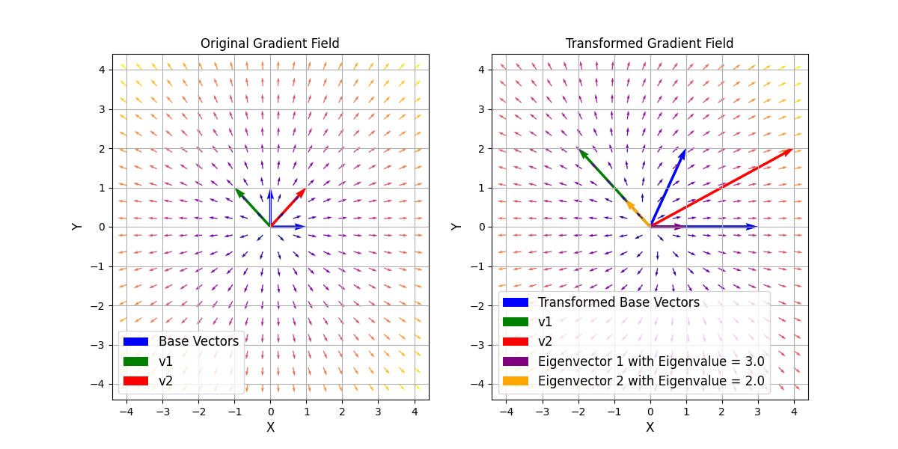

# Vektorfelder und Eigenvektoren

## Einleitung
In diesem Beispiel werden Vektorfelder und Eigenvektoren visualisiert, um ein grundlegendes Verständnis für ihre Bedeutung und Anwendung zu vermitteln. Eigenvektoren und Eigenwerte sind zentrale Konzepte in der linearen Algebra, die in verschiedenen Anwendungen wie der Analyse von linearen Transformationen und der Lösung von Differentialgleichungen eine wichtige Rolle spielen.

Eigenvektoren sind spezielle Vektoren, die unter ihrer korrespondierenden linearen Transformation ihre Richtung nicht ändern, sondern nur skaliert werden. Die zugehörigen Eigenwerte geben an, um welchen Faktor die Eigenvektoren skaliert werden.
Sie sind Lösungen der Gleichung:
$$
\hat{A}\vec{x} = \lambda \vec{x},
$$

wobei $\hat{A}$ die Transformationsmatrix, $\vec{x}$ der Eigenvektor und $\lambda$ der Eigenwert ist.

Diese Gleichung kann durch:
$$
\det(\hat{A} - \lambda \hat{I})\vec{x} = 0
$$
gelöst werden, wobei $\hat{I}$ die Einheitsmatrix ist.

Dieses Beispiel sollte das Konzept der Eigenvektoren und Eigenwerte anschaulich machen. Zusätzlich erhalten Sie einen Einblick in die Visualisierung von Vektorfeldern.


## Aufgabe

1. Erzeugen Sie mittels dem Befehl `np.meshgrid` ein Gitter von $x$- und $y$-Werten. Sie können die Start- und Endwerte für $x$ und $y$ frei wählen. Die Gitter sollte $N \times N$ Punkte haben. Wählen Sie $N$ so zu Begin klein, z.B. $N=10$.

2. Berechnen Sie mittels der Funktion `gradient_field` das Gradientenfeld für das Skalarfeld $V(r) = r^2$.


3. Plotten Sie das Gradientenfeld mit Hilfe von [quiver](https://matplotlib.org/stable/api/_as_gen/matplotlib.pyplot.quiver.html) in einem Subplot. Hier bietet es sich an die Vektoren zu normalisieren, damit die Vektoren nicht zu groß werden. Die Größe der Änderung des Skalarfeldes können Sie farblich darstellen.

4. Plotten Sie die Basisvektor und die Vektoren `v1` und `v2`, wobei

  ```math
  \vec{v}_1 = \begin{bmatrix}
  -1 \\ 1
  \end{bmatrix}
  ```

  ```math
  \vec{v}_2 = \begin{bmatrix}
  1 \\ 1
  \end{bmatrix}.
  ```

5. Führen Sie eine lineare Transformation des Gradientenfeldes durch. Dabei soll die Transformationsmatrix `transformation_matrix` gleich

  ```math
  \hat{A} = \begin{bmatrix}
  3 & 1 \\
  0 & 2
  \end{bmatrix}
  ```

  sein.

6. Plotten Sie das transformierte Gradientenfeld in einem Subplot neben dem ursprünglichen Gradientenfeld. Dieses sollte auch normiert sein und die Farbe sollte die Größe der Änderung des Skalarfeldes darstellen.

7. Plotten Sie zusätzlich die transformierten Basisvektoren und `v1_trans` und `v2_trans`.

8. Stellen Sie die Eigenvektoren der Transformationsmatrix $\hat{A}$ im Plot da.

9. Wählen Sie eine andere Transformationsmatrix und achten Sie was passiert.
  Warum kann die Transformation

  ```math
  \hat{A} =\begin{bmatrix}
  1 & -1 \\
  1 & 1
  \end{bmatrix}
  ```

  nicht dargestellt werden?

<dev align="center">
  
</dev>

## Hinweise

* Für die lineare Transformation können Sie den `@` Operator oder `np.matmul` verwenden.

* Die Befehle `np.vstack` und `np.flatten` könnten hilfreich sein.

* Für die Normierung können Sie entweder die Funktion `np.linalg.norm` oder die Funktion `np.sqrt` verwenden.

* Für dieses Beispiel gibt es beschränkte Tests. Überprüfen Sie daher anhand der Abbildung, ob Ihre Lösung korrekt ist.
